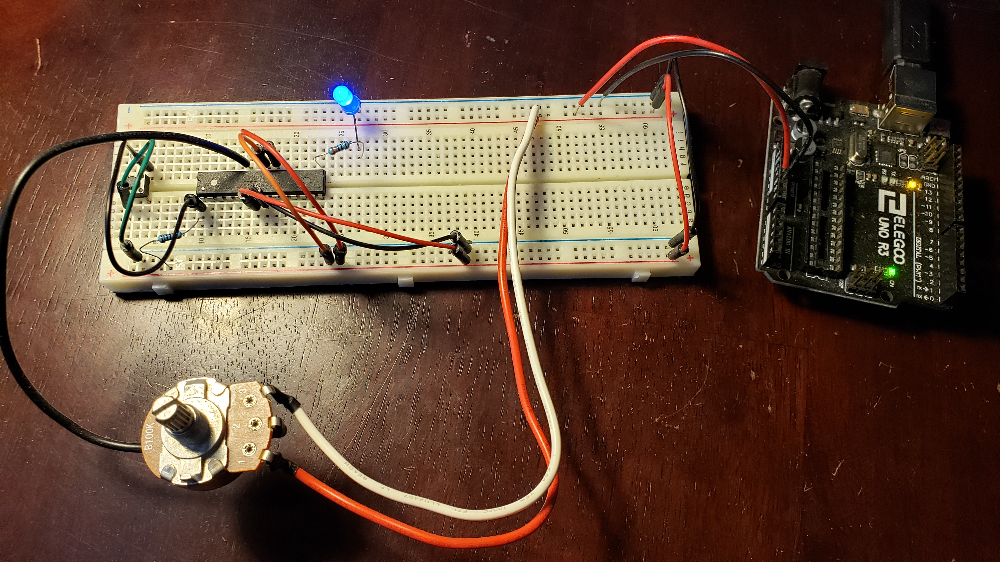

# AVR-ADC (DRAFT ONLY!)

## Purpose

To learn how to use the ADC on the ATmega328p.

I attempt to control the frequency of an led by sending the ADC the output from a potentiometer
configured as a voltage divider. By turning the pot, the frequency should change.

Final Product



## Setup

### The Programmer

My programming setup consists of a Waveshare USB AVRISP XPII programmer conected to a breadboard.
The chip is powered via an arduino board, and has a pull up resistor connected to the reset pin.


### The Software

I use `avr-gcc`, `avr-objcopy`, and `avrdude` to compile, convert to hex, and then upload to the
microcontroller. This is all run on Ubuntu 18.04. `avr-gcc` and `avr-objcopy` can be found in
the Ubuntu repo as `avr-libc` and `avrdude` as `avrdude`. All the commands are layed out in the included makefile.

The makefile included is for general purpose avr programming. For this specific repo you need to give make the name of the C source file to use. In this case using `adc.c` you need to tell make `adc`. To build and upload (using the same programming setup) run the following:

`make file=adc; make upload file=adc`

## Code

```c

define F_CPU 8000000UL
#include <avr/io.h>
#include <util/delay.h>

void main(void)
{
	//setup port
	//using B1 as output
	DDRB = 0x02;
	PORTB = 0x00;
	//setup adc
	//power adc
	PRR = 0xFE;
	//set voltage reference & input channel
	//use AREF & ADC0 (PC0), bits left adjusted
	ADMUX = 0x20;
	//enable adc, set division factor of 8
	ADCSRA |= 0x83;

	while(1){
		//start adc conversion
		ADCSRA |= 0x40;
		//wait for conversion to finish
		while(ADCSRA & 0x40) {}
		// read value from adc
		unsigned int adcVal = ADCH;
		PINB = 0x02;
		for (int x = 0; x < adcVal*2; x++) {
			_delay_ms(1);
		}
	}

}

```

## Diagram


## Demo

(video link here)

## Usefull Links

[avr-libc library reference](https://www.nongnu.org/avr-libc/user-manual/modules.html)

[AVRFREAKS: Bit manipulation](https://www.avrfreaks.net/forum/tut-c-bit-manipulation-aka-programming-101?page=all)
