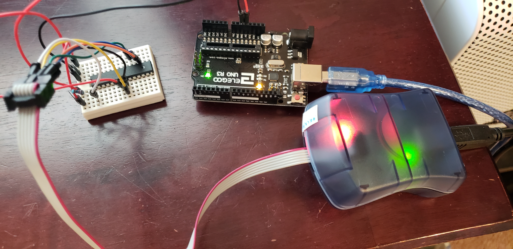

# AVR-ADC

## Purpose

To learn how to use the ADC on the ATmega328p

Final demo

## Setup

### The Programmer

My programming setup consists of a Waveshare USB AVRISP XPII programmer conected to a breadboard.

The chip is powered via an arduino board, and has a pull up resistor connected to the reset pin.

### The Software

I use `avr-gcc`, `avr-objcopy`, and `avrdude` to compile, convert to hex, and then upload to the

microcontroller. This is all run on an Ubuntu 18.04. `avr-gcc` and `avr-objcopy` can be found in

the Ubuntu repo under `avr-libc`. All the commands are layed out in the included makefile.

The makefile is for general purpose avr programming. For this specific repo you need to give

make the name of the C file to use. In this case `avr.c`. To build and upload run the following:

`make file=adc; make upload file=adc`

